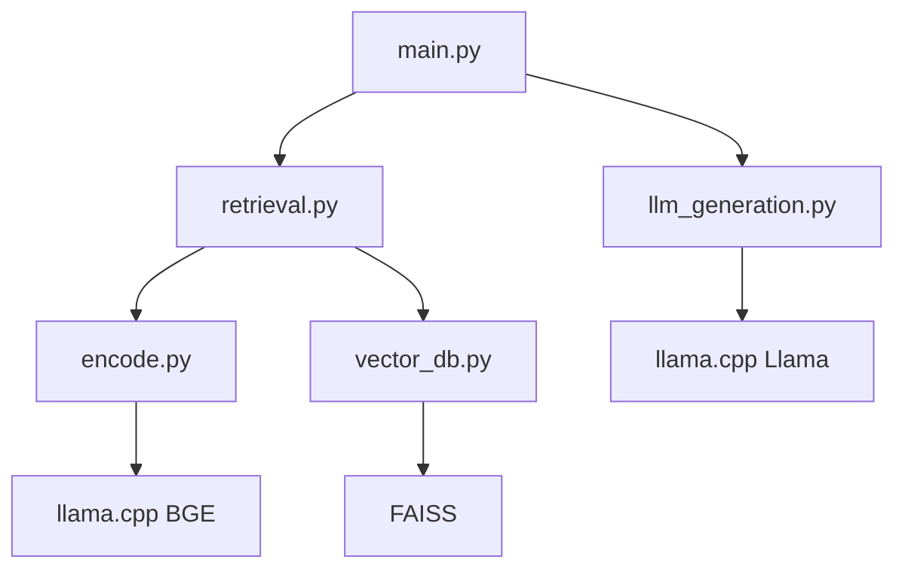

# rags-to-riches

This is an implementation of a RAG system, which improves LLM performance by augmenting a user input with context from a database.

My implementation is in three steps:
I'll first create a vector database, which encodes each document in an inputted dataset into an embedding using the BGE encoder ([huggingface](https://huggingface.co/BAAI/bge-base-en-v1.5)) and loads it into a .json file, then uses [FAISS](https://github.com/facebookresearch/faiss.git) to make a fast similarity search engine within the database.

## Architecture

```
